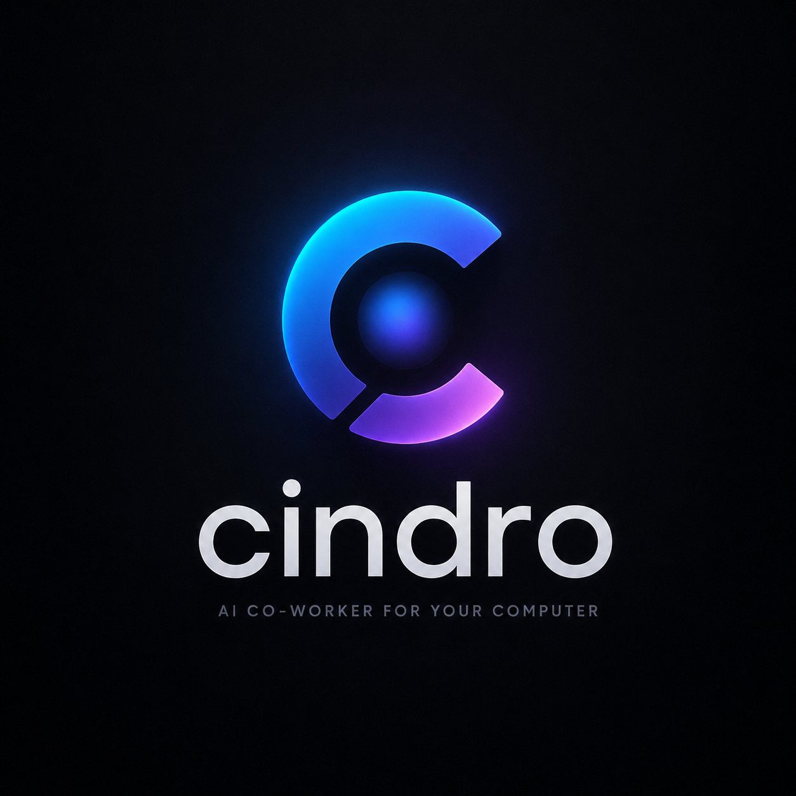
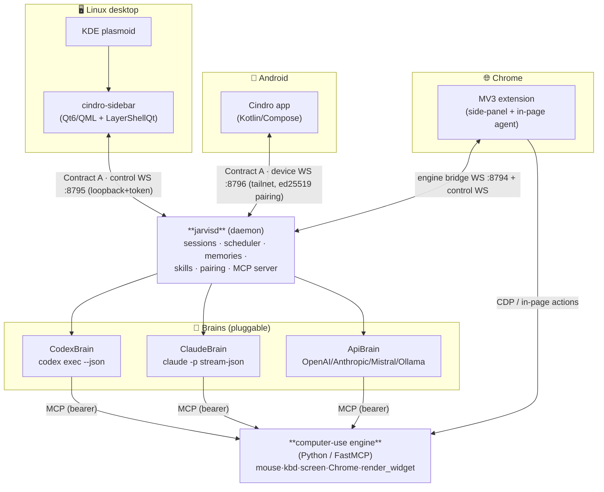

<div align="center">



### One AI co-worker for your **Linux desktop**, **Android phone**, and **Chrome** — that actually *uses* your computer.

Drives mouse / keyboard / screen · works on its own virtual desktop *beside* you · takes over your real screen on request · voice · generative live widgets · cross-device biometric unlock.

[](https://github.com/CrazyMan28/jarvis/stargazers)
[](LICENSE)
[](#)
[](https://github.com/CrazyMan28/jarvis/commits)

[Demo](#-demo) · [Why it exists](#-why-cindro-exists) · [Features](#-what-it-does) · [Architecture](#-architecture) · [Build & run](#-build--run) · [Docs](#-docs) · [Roadmap & limits](#-known-limitations--roadmap)

</div>

---

## 🎬 Demo

<div align="center">

<!-- To embed: drag-and-drop a screen recording onto this section in the GitHub web editor
     (GitHub hosts it and renders an inline <video>), or commit it to docs/media/ and link it. -->

[](docs/media/jarvis-demo.mp4)

*A 60-second tour: ask Cindro to open Chrome on its own desktop → watch it live in chat →
pin a live widget to your home screen → unlock the desktop from your phone's fingerprint.*

</div>

---

## 💡 Why Cindro exists

I daily-drive **Linux** (Sway + KDE Plasma 6), and the polished "AI that uses your computer" products simply don't meet me there:

- **OpenAI's Codex / ChatGPT desktop** computer-use and **Anthropic's Claude** computer-use / "co-work" desktop apps are **macOS- and Windows-first — there's no real Linux story.**
- The excellent agentic **CLIs** (`codex`, `claude`) are headless brains: superb reasoning, but no *body* on a Linux desktop — no GUI, no phone, no voice, no live screen-share, no shared memory across your devices.

So Cindro is the missing body. **One local daemon** gives those brains (and a direct API brain) **hands**:

- a **pixel-accurate computer-use engine** that works on **KDE *and* Sway**,
- a **nested "agent desktop"** so it can work *beside* you without hijacking your screen — or **take over your real screen** with a distinct glowing cursor when you ask,
- and **one coherent world** — sessions, memory, skills, widgets, scheduling — reachable from a **desktop sidebar**, an **Android app**, and a **Chrome extension**.

Local-first. Your keys, your machine, your data. One brain, many hands: a **coder** when you need one, a **co-worker** the rest of the time.

---

## ✨ What it does

| Area | Capability |
|---|---|
| **Brains** | `CodexBrain` (`codex exec`), `ClaudeBrain` (`claude -p`), `ApiBrain` (direct OpenAI / Anthropic / Mistral / Ollama, **with vision** — attached photos reach the model). Per-session model + brain picker. |
| **Desktop UX** | A **Home dashboard** (greeting, active-agent card, quick actions, recent sessions, a **live CPU/RAM/GPU mini-dashboard** from real `/proc` + `nvidia-smi`), a **⌘K command palette** (jump to any page/session), a Claude-Code-style **"/" command palette** in the composer (commands + agents + skills), and a unified **right-side panel** (the model's PLAN on top of an in-chat agent peek that mirrors the nested desktop live). Premium arc-reactor HUD theme. |
| **Agents (subagents)** | Define **custom agents** (name · what it does · *when to call it* · brain/model/profile · system prompt); Cindro dispatches tasks to them via MCP tools (`agent_start`/`agent_list`/`agent_stop`), each running as a **child session** that reports back (shown in the sub-agent tree). Manage them on desktop, phone, and via `/` in chat. → [`docs/AGENTS_AND_COMMANDS.md`](docs/AGENTS_AND_COMMANDS.md) |
| **Computer use** | Pixel-accurate mouse/keyboard/screen on **KDE and Sway** via the Python engine. Runs on a **nested headless agent desktop** by default (watchable live in chat *and* on the phone), or **takes over your real screen** on request — approval-gated, distinct blue cursor + "Cindro is driving" banner. The model can `desktop_reset` its own desktop. → [`docs/COMPUTER_USE.md`](docs/COMPUTER_USE.md) |
| **Chrome** | MV3 extension with a full Cindro side-panel that sees your tabs and acts in-page (Chrome-only mode, blue cursor + "controlling Chrome" banner). |
| **Editors (ACP)** | Drive Cindro from **Zed / JetBrains** as a native [Agent Client Protocol](https://agentclientprotocol.com) agent — real sessions, streamed turns, tool-call cards, in-editor permission prompts — via the `jarvis-acp` stdio bridge. → [`acp-bridge/README.md`](acp-bridge/README.md) |
| **Web** | A **full browser dashboard** (`web/` — Bun+Vite+SolidJS) with **GUI parity**: every page the desktop app has (Home/Chat/Voice/Computer/Canvas/Widgets/Sessions/Memory/Skills/Agents/Schedules/Activity/Graph/Replay/MCP/Plugins/SSH/Phone/Settings, plus Browser), same Arc Reactor HUD theme, same Contract A the extension/TUI speak. `cindro web start` builds it, serves it, and prints the control token to the terminal. → [`web/README.md`](web/README.md) |
| **Terminal** | `cindro` in **any terminal** (Linux + Windows) opens a Claude-Code-style **TUI agent** with **full GUI parity** — all 20 screens (Home/Chat/Sessions/Memory/Skills/Agents/Queue/Schedules/Settings/Canvas/Widgets/Phone/Computer/Browser/Activity/Graph/Replay/MCP/Plugins/SSH), the same first-run wizard and 2FA/fingerprint lock gate, and hands-free **voice mode** (`F2`, real mic capture + STT/TTS). Terminal-only touches on top: a **self-editing layout** (ask Cindro to add/edit/remove a page — declarative, hot-reloads live, no restart) and an extensible **`/` command engine** (fuzzy palette, tab-jump *and* inline-popup commands, self-authored custom commands, `/model`/`/provider` pickers) — plus a faithful terminal recreation of the desktop's spinning **arc-reactor** animation and typewriter-reveal chat replies. And the ops surface: `cindro doctor` (health check with fixes), `cindro status`, `cindro start` (**headless**, no GUI anywhere), `cindro web start`, `cindro ask "…"` for scripts. → [`cli/README.md`](cli/README.md) |
| **Voice** | Hands-free voice mode (just talk — energy-VAD auto-sends, no hold-to-talk), STT/TTS via Mistral Voxtral with **pluggable local providers** (whisper.cpp / piper), animated arc-reactor orb. → [`docs/VOICE.md`](docs/VOICE.md) |
| **Generative renderer** | The model calls `render_widget` to draw **custom UI** from a safe JSON DSL — containers, text, charts, SVG/canvas art, buttons, animation, and **multi-page `pager`** widgets (tap-to-advance quizzes with right/wrong feedback, **no model round-trip**). **Live** canvases auto-refresh (`widget_live`); pin any to the **desktop Home** (`home_pin`, drag to reorder) or to a **real Android home-screen widget** (sizes to its content). Renders on desktop **and** phone. → [`docs/WIDGETS_CANVAS.md`](docs/WIDGETS_CANVAS.md) |
| **Plan & permissions** | The model keeps a live **plan/checklist** (`todo_write` + granular add/edit/done/del) in an animated side panel. A **permission level** (cautious / balanced / autonomous) auto-ranks tools; on top of that, **Trust Policies** are a real **policy engine** — per-tool/per-app `allow`/`ask`/`deny` rules **enforced at the tool layer** (deny fails the call, ask pops an approval on desktop *and* phone), editable in Settings → Permissions. |
| **Reliability & oversight** | A **failure self-healing loop** verifies the screen actually changed after every click/type and auto-retries or forces a re-plan; a **proactive anomaly watcher** learns a baseline of any command and only interrupts on genuine deviations (low-noise); **agent committee mode** solves one task with N parallel strategies and a judge; and **Mission Control Replay** scrubs any past session like a video (timeline of tool calls, screenshots, and thoughts). |
| **Mobile** | Kotlin/Compose app: pair via QR, chat + **photos to the model**, sessions, queue, **live agent-desktop video** (watch + drive remotely), file receive, push, real home-screen widgets, interactive `pager` quizzes. Background WebSocket service delivers notifications **without Firebase**. Bundles the **entire Agent Phone app, vendored verbatim** (Calls/Inbox/Agents/HUD/Settings) in the one APK — see **Phone** below. |
| **Phone** | Cindro can **call and text you on your real phone** — and **answers when you call or text** its number (Cindro is extension 101; it wakes **headlessly** — voice on a call, a reply on a text — and can call/text you back mid-conversation). In-app + real PSTN calls, **free SMS off your phone's own SIM**, an inbox, AI call screening, a war room, voice profiles (incl. your **cloned voices** on calls) — **~56 tools** — plus **per-call permissions** ("what Cindro may do over the phone", enforced at the tool layer) and **one-tap Twilio number verification**. A native subsystem in the one repo; the full app ships on Android, desktop, and Chrome. → [`docs/PHONE.md`](docs/PHONE.md) |
| **Security** | 2FA + biometric **cross-device unlock** (open desktop → approve on phone with fingerprint), plus a **local PIN fallback** when the phone can't approve. SSH allow-list, prompt-injection gating, a **pre-exec shell-command scanner** (destruction/exfil patterns → Allow/Deny prompt), an **OSV malware check** on npx/uvx MCP installs, **tool-loop guardrails** (runaway repeat detection), **multi-key credential pools** with 429 rotation, and strict per-brain **MCP isolation**. |
| **Productivity** | Scheduler (cron + natural language) → [`docs/SCHEDULES.md`](docs/SCHEDULES.md), memories + skills + a "today" digest → [`docs/HERMES_FEATURES.md`](docs/HERMES_FEATURES.md), **full-text search across every past session** (`session_search`), a **durable kanban work queue** that survives restarts (`queue_add` — big jobs run one-by-one overnight), **persistent goals with auto-continue**, a **Mixture-of-Agents second-opinion panel** (`agent_moa`), opt-in **post-turn self-improvement** (Cindro quietly learns reusable facts), custom MCP servers, a plugin registry, and a Google connectors framework → [`docs/JARVIS_GOOGLE_CONNECTORS.md`](docs/JARVIS_GOOGLE_CONNECTORS.md). |

> 📍 **Where it actually is** (done vs. partial vs. next) lives in [`docs/STATUS.md`](docs/STATUS.md) — the honest single source of truth.

---

## 🏗 Architecture



**Contract A** is the wire protocol on every channel: a JSON request `{v,id,method,params}`,
a reply `{v,id,ok,result|error}`, and server-pushed events
`{v,event:"session.event",data:{session_id,ev:<NormalizedBrainEvent>}}`. Brain output (codex /
claude JSONL) is parsed into one **normalized event stream** (`thinking`, `message`,
`tool_call`, `tool_result`, `diff`, `approval`, `final`, `error`, `driving_state`). Full spec: [`docs/ARCHITECTURE.md`](docs/ARCHITECTURE.md).

| Port | Channel | Bind | Auth |
|---|---|---|---|
| `8795` | control WS (desktop ↔ daemon) | loopback | shared token (`~/.config/jarvis/control_token`) |
| `8796` | device WS (phone ↔ daemon) | tailnet | ed25519 pairing handshake |
| `8794` | computer-use engine (MCP) | loopback | bearer token (per-session engines on `8810+`) |

---

## 📦 Repository layout

```
core/         C++/Qt6 shared lib — session model, Brain abstraction, MCP registry,
              scheduler, memories, skills, SSH allow-list, settings, FCM sender, voice
daemon/       jarvisd — headless service: ControlServer (:8795) + DeviceServer (:8796),
              pairing, session orchestration, Jarvis-MCP server, auth challenges
desktop/      cindro-sidebar — QML/Quick + LayerShellQt UI (Home dashboard, chat + in-chat
              agent peek, voice, canvas, widgets, sessions, memory, skills, schedules,
              activity, MCP, plugins, ssh, settings) + ⌘K command palette
computer-use/ Python FastMCP engine (mouse/kbd/screen, Chrome bridge, render_widget,
              nested agent desktop, per-session input routing, agent pointer bus)
extension/    Chrome MV3 "Computer Use Bridge" + Cindro side-panel
acp-bridge/   ACP (Agent Client Protocol) stdio bridge — Zed/JetBrains drive Cindro natively
cli/          the jarvis terminal (legacy TUI): Python/Textual agent + doctor/
              status/start/web/ask commands — superseded by tui/, ops
              commands still live here
tui/          jarvis-tui v2 — TypeScript/Bun + OpenTUI/SolidJS terminal UI,
              a thin client over the same control websocket (see tui/README.md)
web/          Browser dashboard with full GUI parity — Bun+Vite+SolidJS SPA
              over the same control websocket (see web/README.md)
android/      Kotlin/Compose app (MVVM, Room, DataStore, foreground WS service)
kde-applet/   Plasma 6 applet to toggle the sidebar
plugins/      Plugin SDK + signed-package format + registry
packaging/    systemd user units, Sway keybind, install scripts
docs/         Architecture, build spec, feature specs (see docs/ARCHITECTURE.md)
scripts/      Live verification scripts (WS round-trips, voice, auth gate, etc.)
```

---

## 🚀 Build & run

**Desktop (C++/Qt6 + Python engine)**
```bash
cmake -S . -B build -G Ninja          # configure once
cmake --build build                   # builds jarvisd + cindro-sidebar
ctest --test-dir build                # C++ unit + GUI smoke tests
# engine deps:
cd computer-use && python -m venv .venv && .venv/bin/pip install -e . && cd -
env -u PYTHONPATH computer-use/.venv/bin/python -m pytest computer-use/tests -q
```
The one-shot installer copies the binaries to `~/.local/bin`, installs the desktop entry +
systemd user units, and the Sway keybind:
```bash
./packaging/install.sh                # build + install jarvisd, cindro-sidebar, units
```
Then `systemctl --user start jarvisd` and launch **cindro-sidebar** (`--voice` boots straight
into voice mode; `$mod+j` toggles it under Sway).

**Android**
```bash
cd android && ./gradlew :app:assembleDebug
```

**Chrome extension** — load `extension/` unpacked at `chrome://extensions` (Developer mode).

**Bare-machine install (installs everything)**
```bash
./packaging/bootstrap-install.sh     # detects dnf/apt/pacman/zypper, installs ALL deps, builds, installs
```

**Windows (experimental — second-tier)** — a native edition lives entirely in `windows/`
(zero changes to the Linux build). It reuses the same daemon + the ~60 QML pages + the Python
engine via a Win32 backend; ships as a **self-contained `Cindro-Setup.exe`** that bundles Qt, the
MSVC runtime, a frozen Python engine, and a portable Node — the user needs nothing pre-installed.
**Priority is Linux + Android first; Windows tracks them and may lag.** See [`docs/WINDOWS.md`](docs/WINDOWS.md).

**No Codex/Claude CLI?** Cindro falls back to a direct **Mistral** brain (chat + voice + a full
function-calling loop so it drives the computer too). See [`docs/MISTRAL_SETUP.md`](docs/MISTRAL_SETUP.md).

> ⚠️ Always run Python/builds with `env -u PYTHONPATH` (a user site-packages `PYTHONPATH` leak
> breaks the engine venv). Never broad-kill `foot` / `sway` / `kwin`; stop processes by PID/unit.

---

## 🧭 Known limitations & roadmap

Honest about the rough edges (full status in [`docs/STATUS.md`](docs/STATUS.md)):

- **Battery: auto-killing an unused nested desktop is not done yet — on purpose.** When you're
  not watching a session, the *expensive* parts are already paused (live-widget loops and the
  video mirror are viewer-gated), so an idle, unwatched agent desktop sits near 0% CPU. Fully
  **tearing it down** to "save battery" would look like a win but would silently **break the
  agent's computer link**: the brain (codex/claude) has its computer-use engine's address +
  token *baked in at spawn*, so a torn-down desktop comes back on a new port/token the brain
  can't reach. The correct fix is **lazy-provisioning the engine at a stable, deterministic
  per-session port** so it can be stopped and restarted transparently — a real refactor, tracked
  rather than rushed.
- **Phone-approved unlock can occasionally hang** (root cause needs a live repro). Mitigated:
  a **local PIN** shows on the lock screen *while it's still waiting on the phone*, so you never
  have to relaunch.
- **Android widget sizing is best-effort.** An app can only *request* a home-screen tile size;
  most launchers honor the content-height hint, a few keep your manual drag size.
- This is a **single-developer, actively-built** project (Sway + KDE Plasma 6, Android, Chrome).
  Packaging beyond `packaging/install.sh` is minimal.

---

## 📚 Docs

- [`docs/STATUS.md`](docs/STATUS.md) — **where the project actually is** (done vs partial vs next)
- [`docs/PHONE.md`](docs/PHONE.md) — **native phone** subsystem: the full agent-phone UI on desktop (QML), Android (Compose v0.10.6+), and Chrome (MV3) — Calls (real dialpad + ext chips), Inbox (text-an-agent), per-agent voice/model config, call screening, Bluetooth relay, SMS agent, setup wizard. Jarvis = ext 101. Two daemon proxies: `phone.mcp` (MCP tools) + `phone.http` (REST API, bearer in daemon). Feature inventory: [`docs/AGENT_PHONE_FEATURE_MAP.md`](docs/AGENT_PHONE_FEATURE_MAP.md)
- [`docs/BACKGROUND_JOBS.md`](docs/BACKGROUND_JOBS.md) — background jobs, `monitor`, sleep/wake (auto session-wake)
- [`docs/HOOKS.md`](docs/HOOKS.md) — Claude-Code-style lifecycle hooks · [`docs/MODES.md`](docs/MODES.md) — plan/build/co-worker modes
- [`docs/ARCHITECTURE.md`](docs/ARCHITECTURE.md) — system design + Contract A/B/C protocols
- [`docs/COMPUTER_USE.md`](docs/COMPUTER_USE.md) — the computer-use engine + nested agent desktop
- [`docs/AGENTS_AND_COMMANDS.md`](docs/AGENTS_AND_COMMANDS.md) — the "/" command palette + custom agents (subagents)
- [`docs/WIDGETS_CANVAS.md`](docs/WIDGETS_CANVAS.md) — canvases, widgets, `pager`, Home pins, home-screen widgets
- [`docs/JARVIS_VOICE_AND_RENDERER.md`](docs/JARVIS_VOICE_AND_RENDERER.md) / [`docs/VOICE.md`](docs/VOICE.md) — voice + generative renderer
- [`docs/SCHEDULES.md`](docs/SCHEDULES.md) · [`docs/HERMES_FEATURES.md`](docs/HERMES_FEATURES.md) · [`docs/JARVIS_GOOGLE_CONNECTORS.md`](docs/JARVIS_GOOGLE_CONNECTORS.md) · [`docs/TAKEOVER_UX.md`](docs/TAKEOVER_UX.md) · [`docs/KWIN_MULTISEAT_FORK.md`](docs/KWIN_MULTISEAT_FORK.md)
- [`docs/OUTPOST.md`](docs/OUTPOST.md) — pair a remote machine and run gated exec/screenshot on it by name · [`docs/PROXMOX_WORKLOAD_MANAGER.md`](docs/PROXMOX_WORKLOAD_MANAGER.md) — an always-on Cindro agent that lives ON a Proxmox host, auto-tunes congested VMs' CPU/RAM (never restarts on its own), agentlessly scouts what runs INSIDE every VM/CT into per-VM `JARVIS.md` profiles, interviews you about what each VM is for, answers asks/tasks from your main Cindro in seconds, and watches "Pinged" rules ("when X happens on this VM, check up on it and fix it") — installed as an Outpost capability
- [`docs/WINDOWS.md`](docs/WINDOWS.md) — the **Windows edition** (parity matrix, what's not portable, install/build) · [`docs/MISTRAL_SETUP.md`](docs/MISTRAL_SETUP.md) — **Cindro without Codex/Claude** (chat + drive with Mistral)
- [`AGENTS.md`](AGENTS.md) — **read this first if you're an AI working on the repo**

---

## 📄 License

[MIT](LICENSE) © 2026 kihi2024.

<div align="center">
<sub>Built because the Linux desktop deserves a real AI co-worker too. ⭐ it if you agree.</sub>
</div>
