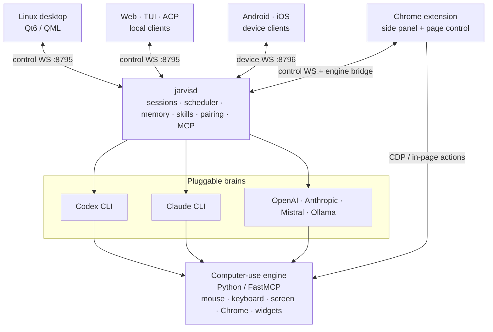

<div align="center">


# Cindro

### A local-first AI co-worker for your Linux desktop, phone, browser, and terminal — with real computer use.

Cindro can work on its own isolated desktop beside you, take over your real screen when approved, talk by voice, render live interfaces, and continue the same sessions across devices.

[](https://github.com/CrazyMan28/jarvis/stargazers)
[](LICENSE)
[](#platform-status)
[](docs/STATUS.md)

[Demo](#demo) · [Highlights](#highlights) · [Quick start](#quick-start) · [Architecture](#architecture) · [Platform status](#platform-status) · [Documentation](#documentation)

</div>

> [!IMPORTANT]
> Cindro is under active development. Linux and Android are the primary targets; Windows is experimental and the native iOS client is still foundation-level. See [`docs/STATUS.md`](docs/STATUS.md) for the honest, current done/partial/next breakdown.

## Demo

<div align="center">

[](docs/media/jarvis-demo.mp4)

*A 60-second tour: ask Cindro to open Chrome on its own desktop, watch it work live in chat, pin a generated widget, and unlock the desktop from your phone.*

</div>

## What Cindro is

Most agentic CLIs provide a powerful brain but no shared desktop, mobile client, visual workspace, or persistent cross-device environment. Cindro supplies that missing body through one local daemon and a set of thin clients.

- **Work beside the agent.** Cindro normally runs computer-use tasks inside a nested agent desktop, so your real mouse and keyboard remain yours.
- **Hand over the real screen when needed.** Takeover is explicit, approval-gated, and visibly marked with a separate cursor and driving banner.
- **Use one workspace everywhere.** Sessions, memory, skills, agents, schedules, widgets, approvals, and live computer video are shared across desktop, Android, Chrome, web, and terminal clients.
- **Bring the brain you prefer.** Use Codex CLI, Claude CLI, or direct OpenAI, Anthropic, Mistral, and Ollama providers.

The product is branded **Cindro**, while several repository paths and services retain the original **Jarvis** names, including the `jarvisd` daemon and `~/.config/jarvis/` configuration directory.

## Highlights

| Area | What it provides |
|---|---|
| **Computer use** | Pixel-accurate mouse, keyboard, screen, and Chrome control on KDE and Sway. Tasks run on a watchable nested desktop by default, with approval-gated real-screen takeover when requested. See [`docs/COMPUTER_USE.md`](docs/COMPUTER_USE.md). |
| **Multiple brains** | `CodexBrain`, `ClaudeBrain`, and `ApiBrain` with per-session provider/model selection and vision for attached images. Direct providers include OpenAI, Anthropic, Mistral, and Ollama. |
| **Everywhere clients** | Qt/QML Linux sidebar, Kotlin/Compose Android app, Chrome MV3 side panel, SolidJS web dashboard, terminal UI, and an ACP bridge for Zed and JetBrains. |
| **Agents and orchestration** | Reusable custom agents, child sessions, MCP dispatch, sub-agent trees, committee runs, second-opinion panels, persistent goals, and an overnight-safe durable work queue. See [`docs/AGENTS_AND_COMMANDS.md`](docs/AGENTS_AND_COMMANDS.md). |
| **Voice and generative UI** | Hands-free voice, pluggable local STT/TTS, live canvases, charts, SVG/canvas art, interactive pagers, desktop Home pins, and Android home-screen widgets. See [`docs/VOICE.md`](docs/VOICE.md) and [`docs/WIDGETS_CANVAS.md`](docs/WIDGETS_CANVAS.md). |
| **Memory and automation** | Searchable session history, memories, skills, natural-language schedules, background jobs, hooks, a daily digest, and optional post-turn learning. |
| **Phone and messaging** | In-app and real phone calls, SMS through the phone's SIM, call screening, voice profiles, per-call permissions, and headless wake-up for incoming calls or texts. See [`docs/PHONE.md`](docs/PHONE.md). |
| **Security and approvals** | Cross-device biometric unlock, local PIN fallback, per-tool/app trust policies, prompt-injection gating, shell-command scanning, OSV checks for MCP installs, SSH allow-lists, and tool-loop guardrails. |
| **Infrastructure control** | Outpost pairing for remote machines and a Proxmox workload-manager agent that can inspect, profile, and safely tune VM/CT resources. See [`docs/OUTPOST.md`](docs/OUTPOST.md) and [`docs/PROXMOX_WORKLOAD_MANAGER.md`](docs/PROXMOX_WORKLOAD_MANAGER.md). |

## Quick start

### Fastest Linux install

The bootstrap installer supports `dnf`, `apt`, `pacman`, and `zypper`. It installs dependencies, builds the project, and installs the desktop components and user services.

```bash
git clone https://github.com/CrazyMan28/jarvis.git
cd jarvis
./packaging/bootstrap-install.sh

systemctl --user start jarvisd
cindro-sidebar
```

Under Sway, `$mod+j` toggles the sidebar after installation. Launch `cindro-sidebar --voice` to open directly into voice mode.

### Developer build

```bash
cmake -S . -B build -G Ninja
cmake --build build
ctest --test-dir build

cd computer-use
python -m venv .venv
.venv/bin/pip install -e .
cd -

env -u PYTHONPATH computer-use/.venv/bin/python -m pytest computer-use/tests -q
```

Install the built desktop components with:

```bash
./packaging/install.sh
systemctl --user start jarvisd
cindro-sidebar
```

> [!WARNING]
> Run Python builds and tests with `env -u PYTHONPATH`. A user-level `PYTHONPATH` can leak packages into the engine virtual environment. Stop nested desktop processes by PID or systemd unit; never broad-kill `foot`, `sway`, or `kwin`.

### Other clients

| Client | Start here |
|---|---|
| **Android** | `cd android && ./gradlew :app:assembleDebug` |
| **Chrome** | Load `extension/` unpacked from `chrome://extensions` with Developer mode enabled. |
| **Web dashboard** | Run `cindro web start`. See [`web/README.md`](web/README.md). |
| **Terminal UI** | Run `cindro`. Operational commands include `cindro doctor`, `cindro status`, `cindro start`, and `cindro ask "…"`. See [`tui/README.md`](tui/README.md) and [`cli/README.md`](cli/README.md). |
| **Zed / JetBrains** | Configure the `jarvis-acp` stdio bridge. See [`acp-bridge/README.md`](acp-bridge/README.md). |
| **Windows** | Use the isolated Windows edition under `windows/`. It is experimental and may lag Linux/Android. See [`docs/WINDOWS.md`](docs/WINDOWS.md). |
| **iPhone** | The native SwiftUI client lives in `iphone_app/` and is not yet verified end-to-end. See [`iphone_app/README.md`](iphone_app/README.md). |

No Codex or Claude CLI is required: Cindro can fall back to a direct Mistral brain with chat, voice, tool calling, and computer use. See [`docs/MISTRAL_SETUP.md`](docs/MISTRAL_SETUP.md).

## Platform status

| Surface | Status | Notes |
|---|---|---|
| **Linux desktop** | Primary | KDE Plasma 6 and Sway; full daemon, sidebar, nested desktop, takeover, and computer-use stack. |
| **Android** | Primary | Chat-first Compose app with pairing, sessions, live computer view/control, widgets, phone features, files, and approvals. |
| **Chrome extension** | Active | Full side panel plus in-page computer-use bridge. |
| **Web and terminal** | Active | Thin clients over the same control protocol, with broad GUI parity. |
| **Windows** | Experimental | Self-contained Windows edition and validated Sandbox isolation tier; second-tier and may lag. |
| **iOS** | Foundation | Native SwiftUI port exists, but compilation and live-device verification are still outstanding. |

Status changes quickly. [`docs/STATUS.md`](docs/STATUS.md) is the single source of truth for what is complete, partial, experimental, or planned.

## Architecture



All clients speak a versioned request/reply protocol and receive one normalized event stream regardless of the selected brain. Full protocol and component details live in [`docs/ARCHITECTURE.md`](docs/ARCHITECTURE.md).

| Port | Channel | Bind | Authentication |
|---|---|---|---|
| `8795` | Control WebSocket for desktop, web, TUI, and local clients | Loopback | Shared token in `~/.config/jarvis/control_token` |
| `8796` | Device WebSocket for phone clients | Tailnet | Ed25519 pairing handshake |
| `8794` | Computer-use engine / MCP bridge | Loopback | Per-session bearer token; additional engines use `8810+` |

## Repository map

| Path | Purpose |
|---|---|
| `core/` | Shared C++/Qt6 models, brains, MCP registry, scheduler, memory, skills, settings, security, and voice. |
| `daemon/` | `jarvisd`: control/device WebSockets, pairing, session orchestration, auth challenges, and Jarvis MCP. |
| `desktop/` | Qt/QML sidebar and the main Linux desktop interface. |
| `computer-use/` | Python/FastMCP mouse, keyboard, screen, Chrome, renderer, nested desktop, and input-routing engine. |
| `android/` / `iphone_app/` | Native mobile clients using the device protocol. |
| `extension/` | Chrome MV3 side panel and browser-control bridge. |
| `web/` / `tui/` / `cli/` | Browser dashboard, modern terminal UI, and operational CLI commands. |
| `acp-bridge/` | Agent Client Protocol bridge for supported editors. |
| `plugins/` | Plugin SDK, signed package format, and registry. |
| `outpost-mcp/` / `proxmox-mcp/` | Remote-machine pairing and Proxmox workload management. |
| `windows/` | Isolated Windows edition and its platform-specific computer-use backends. |
| `packaging/` | Install scripts, desktop integration, systemd user units, and Sway configuration. |
| `website/` | Laravel marketing, billing, license-verification, and admin application. |
| `docs/` | Architecture, platform, feature, security, and implementation documentation. |

## Documentation

### Start here

- [`docs/STATUS.md`](docs/STATUS.md) — current done/partial/next status
- [`AGENTS.md`](AGENTS.md) — required repo guidance and gotchas for coding agents
- [`docs/ARCHITECTURE.md`](docs/ARCHITECTURE.md) — system design and Contract A/B/C protocols

### Core capabilities

- [`docs/COMPUTER_USE.md`](docs/COMPUTER_USE.md) — nested desktop, takeover, and computer-use engine
- [`docs/AGENTS_AND_COMMANDS.md`](docs/AGENTS_AND_COMMANDS.md) — custom agents and slash commands
- [`docs/WIDGETS_CANVAS.md`](docs/WIDGETS_CANVAS.md) — canvases, live widgets, pagers, and Home pins
- [`docs/VOICE.md`](docs/VOICE.md) — voice capture, STT, TTS, and providers
- [`docs/PHONE.md`](docs/PHONE.md) — calls, SMS, screening, voice profiles, and phone permissions
- [`docs/BACKGROUND_JOBS.md`](docs/BACKGROUND_JOBS.md) — monitors, sleep/wake, and session wake-up
- [`docs/HOOKS.md`](docs/HOOKS.md) and [`docs/MODES.md`](docs/MODES.md) — lifecycle hooks and plan/build/co-worker modes
- [`docs/SCHEDULES.md`](docs/SCHEDULES.md) and [`docs/HERMES_FEATURES.md`](docs/HERMES_FEATURES.md) — scheduling, memory, skills, and daily workflows

### Platforms and infrastructure

- [`docs/WINDOWS.md`](docs/WINDOWS.md) — Windows architecture, parity, build, and installation
- [`iphone_app/README.md`](iphone_app/README.md) — iOS parity and remaining platform gaps
- [`web/README.md`](web/README.md) and [`tui/README.md`](tui/README.md) — browser and terminal clients
- [`docs/OUTPOST.md`](docs/OUTPOST.md) — remote machine pairing and gated control
- [`docs/PROXMOX_WORKLOAD_MANAGER.md`](docs/PROXMOX_WORKLOAD_MANAGER.md) — Proxmox inspection and safe resource tuning
- [`docs/JARVIS_GOOGLE_CONNECTORS.md`](docs/JARVIS_GOOGLE_CONNECTORS.md) — Google connector framework
- [`docs/MISTRAL_SETUP.md`](docs/MISTRAL_SETUP.md) — running without Codex or Claude CLI

## Known limitations

- This is a single-developer, actively built project; packaging outside the included installers is still limited.
- Unwatched nested desktops pause expensive live-widget and video work, but full idle desktop teardown is not implemented yet.
- Phone-approved unlock can occasionally hang; a local PIN remains available while the phone request is pending.
- Android home-screen widget sizing is best-effort because launchers control the final tile size.
- Windows may trail the primary Linux/Android targets, and iOS still needs compile and device verification.

Detailed root causes, mitigations, and current work are tracked in [`docs/STATUS.md`](docs/STATUS.md).

## Working on the repository

Read [`AGENTS.md`](AGENTS.md) before making changes. It contains required repository rules, validation expectations, platform priorities, and process-safety warnings. Update [`docs/STATUS.md`](docs/STATUS.md) whenever a change materially moves a feature between planned, partial, experimental, or complete.

## License

[MIT](LICENSE) © 2026 kihi2024.

<div align="center">
<sub>Built because the Linux desktop deserves a real AI co-worker too.</sub>
</div>
