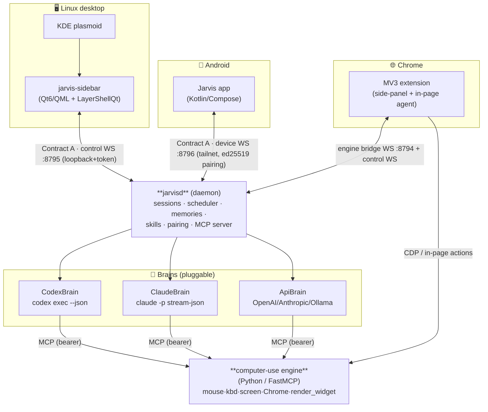

# Jarvis — a unified AI co-worker

Jarvis is a single AI co-worker that lives in a polished sidebar on your Linux desktop,
can **drive your computer** (mouse / keyboard / screen + Chrome), works **beside you on its
own virtual desktop** or **takes over your real screen** with a distinct glowing cursor, and
is fully controllable from a companion **Android app** and a **Chrome extension** — chat,
photos, voice, live session view, scheduling, memories, skills, and push.

One brain, many hands: it can be a **coder** when you need one and a **co-worker** otherwise.

> Status: actively built, single-developer project. Desktop (Sway + KDE Plasma 6), Android,
> and the Chrome extension all run today against the local daemon.

---

## What it does

| Area | Capability |
|---|---|
| **Brains** | `CodexBrain` (`codex exec`), `ClaudeBrain` (`claude -p`), `ApiBrain` (direct OpenAI/Anthropic/Mistral/Ollama, **with vision** — attached photos reach the model). Per-session model + brain picker. |
| **Desktop UX** | A **Home dashboard** (greeting, active-agent card, quick actions, recent sessions, a **live CPU/RAM/GPU mini-dashboard** from real `/proc` + `nvidia-smi`), a **⌘K command palette** (jump to any page/session), and an **in-chat agent peek** that mirrors the nested desktop live (drag-resizable, "⛶ Full"). Premium HUD theme (solid cards, arc-reactor accents). |
| **Computer use** | Pixel-accurate mouse/keyboard/screen on KDE **and** Sway via the Python engine. Runs on a **nested headless agent desktop** by default (watchable live in chat *and* on the phone), or **takes over your real screen** on request (approval-gated, distinct blue cursor + "Jarvis is driving" banner). The model can `desktop_reset` its own desktop. |
| **Chrome** | MV3 extension with a full Jarvis side-panel that sees your tabs and acts in-page (Chrome-only mode, blue cursor + "controlling Chrome" banner). |
| **Voice** | Hands-free voice mode (just talk — energy VAD auto-sends, no hold-to-talk), STT/TTS via Mistral Voxtral with **pluggable local providers** (whisper.cpp / piper), animated arc-reactor orb. |
| **Generative renderer** | The model calls `render_widget` to draw **custom UI** from a safe JSON DSL (containers, text, charts, SVG/canvas art, buttons, animation, and **multi-page `pager`** widgets — tap-to-advance quizzes with right/wrong feedback, no model round-trip). *Canvases* are ad-hoc; *Widgets* are saved/reusable; **pin any to the desktop Home** (`home_pin`, drag to reorder) or to a **real Android home-screen widget** (sizes to its content). **Live** canvases auto-refresh (`widget_live`). Renders on desktop **and phone**. See [`docs/WIDGETS_CANVAS.md`](docs/WIDGETS_CANVAS.md). |
| **Plan & permissions** | The model keeps a live **plan/checklist** (`todo_write` + granular add/edit/done/del) shown in an animated side panel. A **permission level** (cautious / balanced / autonomous) auto-ranks tools and makes Jarvis `ask_user` before risky actions. |
| **Mobile** | Kotlin/Compose app: pair via QR, chat + **photos to the model**, sessions, queue, **live agent-desktop video** (watch + drive), file receive, push, real home-screen widgets, and a Compose widget renderer (incl. interactive `pager` quizzes). Background WebSocket service delivers notifications **without Firebase**. |
| **Security** | 2FA + biometric **cross-device unlock** (open desktop → approve on phone with fingerprint), plus a **local PIN fallback** when the phone can't approve. SSH allow-list, prompt-injection gating, strict per-brain **MCP isolation** with opt-in CLI MCP toggles. |
| **Productivity** | Scheduler (cron + natural language), memories, skills + "today" digest, custom MCP servers, a plugin registry, and Google connectors (Calendar/Docs/Drive/Gmail) framework. |

---

## Architecture



**Contract A** is the wire protocol on every channel: a JSON request `{v,id,method,params}`,
a reply `{v,id,ok,result|error}`, and server-pushed events
`{v,event:"session.event",data:{session_id,ev:<NormalizedBrainEvent>}}`. Brain output (codex /
claude JSONL) is parsed into one **normalized event stream** (`thinking`, `message`,
`tool_call`, `tool_result`, `diff`, `approval`, `final`, `error`, `driving_state`).

| Port | Channel | Bind | Auth |
|---|---|---|---|
| `8795` | control WS (desktop ↔ daemon) | loopback | shared token (`~/.config/jarvis/control_token`) |
| `8796` | device WS (phone ↔ daemon) | tailnet | ed25519 pairing handshake |
| `8794` | computer-use engine (MCP) | loopback | bearer token |

---

## Repository layout

```
core/         C++/Qt6 shared lib — session model, Brain abstraction, MCP registry,
              scheduler, memories, skills, SSH allow-list, settings, FCM sender, voice
daemon/       jarvisd — headless service: ControlServer (:8795) + DeviceServer (:8796),
              pairing, session orchestration, Jarvis-MCP server, auth challenges
desktop/      jarvis-sidebar — QML/Quick + LayerShellQt UI (Home dashboard, chat + in-chat
              agent peek, voice, canvas, widgets, sessions, memory, skills, schedules,
              activity, MCP, plugins, ssh, settings) + ⌘K command palette
computer-use/ Python FastMCP engine (mouse/kbd/screen, Chrome bridge, render_widget,
              nested agent desktop, per-session input routing, agent pointer bus)
extension/    Chrome MV3 "Computer Use Bridge" + Jarvis side-panel
android/      Kotlin/Compose app (MVVM, Room, DataStore, foreground WS service)
kde-applet/   Plasma 6 applet to toggle the sidebar
plugins/      Plugin SDK + signed-package format + registry
packaging/    systemd user units, Sway keybind, install scripts
docs/         Architecture, build spec, feature specs (see docs/ARCHITECTURE.md)
scripts/      Live verification scripts (WS round-trips, voice, auth gate, etc.)
```

---

## Build & run

**Desktop (C++/Qt6 + Python engine)**
```bash
cmake -S . -B build -G Ninja          # configure once
cmake --build build                   # builds jarvisd + jarvis-sidebar
ctest --test-dir build                # unit tests
# engine deps:
cd computer-use && python -m venv .venv && .venv/bin/pip install -e . && cd -
env -u PYTHONPATH computer-use/.venv/bin/python -m pytest computer-use/tests -q
```
Install + run: copy `build/daemon/jarvisd` and `build/desktop/jarvis-sidebar` to `~/.local/bin`,
start `jarvisd` (a systemd user unit lives in `packaging/`), then launch `jarvis-sidebar`
(`--voice` boots straight into voice mode).

**Android**
```bash
cd android && ./gradlew :app:assembleDebug
```

**Chrome extension** — load `extension/` unpacked at `chrome://extensions` (Developer mode).

> ⚠️ Always run Python/builds with `env -u PYTHONPATH` (a user site-packages `PYTHONPATH` leak
> breaks the engine venv). Never broad-kill `foot` / `sway` / `kwin`; stop processes by PID/unit.

---

## Docs

- [`docs/STATUS.md`](docs/STATUS.md) — **where the project actually is** (done vs partial vs next)
- [`docs/ARCHITECTURE.md`](docs/ARCHITECTURE.md) — system design
- [`docs/COMPUTER_USE.md`](docs/COMPUTER_USE.md) — the computer-use engine
- [`docs/WIDGETS_CANVAS.md`](docs/WIDGETS_CANVAS.md) — canvases, widgets, `pager`, Home pins, home-screen widgets
- [`docs/JARVIS_VOICE_AND_RENDERER.md`](docs/JARVIS_VOICE_AND_RENDERER.md) — voice + generative renderer
- [`docs/JARVIS_GOOGLE_CONNECTORS.md`](docs/JARVIS_GOOGLE_CONNECTORS.md) — Google connectors
- [`docs/KWIN_MULTISEAT_FORK.md`](docs/KWIN_MULTISEAT_FORK.md) — the agent's own seat/cursor
- [`AGENTS.md`](AGENTS.md) — **read this first if you're an AI working on the repo**

---

## License

Personal project — all rights reserved (no license granted yet).
