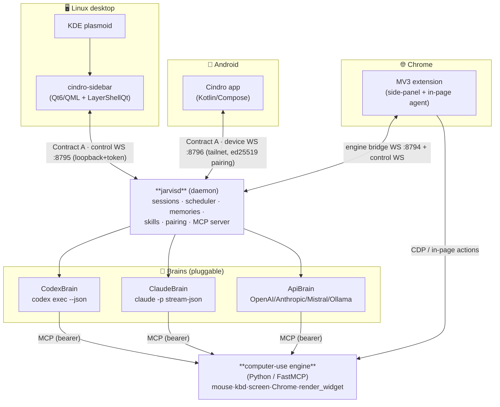

<div align="center">


### One AI co-worker for your **Linux desktop**, **Android phone**, and **Chrome** — that actually *uses* your computer.

Drives mouse / keyboard / screen · works on its own virtual desktop *beside* you · takes over your real screen on request · voice · generative live widgets · cross-device biometric unlock.

[](https://github.com/CrazyMan28/jarvis/stargazers)
[](LICENSE)
[](#)
[](https://github.com/CrazyMan28/jarvis/commits)

[Demo](#-demo) · [Quick Start](#-quick-start) · [Why it exists](#-why-cindro-exists) · [Features](#-what-it-does) · [Architecture](#-architecture) · [Build & run](#-build--run) · [Docs](#-docs) · [Roadmap](#-known-limitations--roadmap)

</div>

---

## 🎬 Demo

<div align="center">

[](docs/media/jarvis-demo.mp4)

*60-second tour: ask Cindro to open Chrome on its own desktop → watch it live in chat → pin a live widget to your home screen → unlock the desktop from your phone's fingerprint.*

</div>

---

## 🚀 Quick Start

```bash
# One-shot install (builds + installs into ~/.local)
./packaging/install.sh

# Start the daemon and open the sidebar
systemctl --user start jarvisd
cindro-sidebar              # or toggle with $mod+j under Sway
```

For **Android**: build with `cd android && ./gradlew :app:assembleDebug`, or load the **Chrome extension** unpacked at `chrome://extensions` (Developer mode).

Full build instructions → [Build & run](#-build--run)

---

## 💡 Why Cindro exists

Linux desktop AI tools were either **headless CLIs** (smart but no GUI/phone/voice) or **macOS/Windows-only** (not real Linux). Cindro is the missing body:

- **One local daemon** gives Claude/Codex/Mistral **hands** — pixel-accurate computer-use on KDE *and* Sway
- **Nested agent desktop** so it works *beside* you (or takes over your real screen on request)
- **One coherent world** — sessions, memory, skills, widgets, scheduling — on desktop, phone, and Chrome

Local-first. Your keys, your machine, your data. One brain, many hands: a **coder** when you need one, a **co-worker** the rest of the time.

---

## ✨ What it does

| Area | Capability |
|---|---|
| **Brains** | `CodexBrain` (`codex exec`), `ClaudeBrain` (`claude -p`), `ApiBrain` (direct OpenAI / Anthropic / Mistral / Ollama, **with vision** — attached photos reach the model). Per-session model + brain picker. |
| **Desktop UX** | A **Home dashboard** (greeting, active-agent card, quick actions, recent sessions, a **live CPU/RAM/GPU mini-dashboard** from real `/proc` + `nvidia-smi`), a **⌘K command palette** (jump to any page/session), a Claude-Code-style **"/" command palette** in the composer (commands + agents + skills), and a unified **right-side panel** (the model's PLAN on top of an in-chat agent peek that mirrors the nested desktop live). Premium arc-reactor HUD theme. |
| **Agents (subagents)** | Define **custom agents** (name · what it does · *when to call it* · brain/model/profile · system prompt); Cindro dispatches tasks to them via MCP tools (`agent_start`/`agent_list`/`agent_stop`), each running as a **child session** that reports back (shown in the sub-agent tree). Manage them on desktop, phone, and via `/` in chat. → [`docs/AGENTS_AND_COMMANDS.md`](docs/AGENTS_AND_COMMANDS.md) |
| **Computer use** | Pixel-accurate mouse/keyboard/screen on **KDE and Sway** via the Python engine. Runs on a **nested headless agent desktop** by default (watchable live in chat *and* on the phone), or **takes over your real screen** on request — approval-gated, distinct blue cursor + "Cindro is driving" banner. The model can `desktop_reset` its own desktop. → [`docs/COMPUTER_USE.md`](docs/COMPUTER_USE.md) |
| **Chrome** | MV3 extension with a full Cindro side-panel that sees your tabs and acts in-page (Chrome-only mode, blue cursor + "controlling Chrome" banner). |
| **Editors (ACP)** | Drive Cindro from **Zed / JetBrains** as a native [Agent Client Protocol](https://agentclientprotocol.com) agent — real sessions, streamed turns, tool-call cards, in-editor permission prompts — via the `jarvis-acp` stdio bridge. → [`acp-bridge/README.md`](acp-bridge/README.md) |
| **Web** | A **full browser dashboard** (`web/` — Bun+Vite+SolidJS) with **GUI parity**: every page the desktop app has (Home/Chat/Voice/Computer/Canvas/Widgets/Sessions/Memory/Skills/Agents/Schedules/Activity/Graph/Replay/MCP/Plugins/SSH/Phone/Settings, plus Browser), same Arc Reactor HUD theme, same Contract A the extension/TUI speak. `cindro web start` builds it, serves it, and prints the control token to the terminal. → [`web/README.md`](web/README.md) |
| **Terminal** | `cindro` in **any terminal** (Linux + Windows) opens a Claude-Code-style **TUI agent** with **full GUI parity** — all 20 screens (Home/Chat/Sessions/Memory/Skills/Agents/Queue/Schedules/Settings/Canvas/Widgets/Phone/Computer/Browser/Activity/Graph/Replay/MCP/Plugins/SSH), the same first-run wizard and 2FA/fingerprint lock gate, and hands-free **voice mode** (`F2`, real mic capture + STT/TTS). Terminal-only touches on top: a **self-editing layout** (ask Cindro to add/edit/remove a page — declarative, hot-reloads live, no restart) and an extensible **`/` command engine** (fuzzy palette, tab-jump *and* inline-popup commands, self-authored custom commands, `/model`/`/provider` pickers) — plus a faithful terminal recreation of the desktop's spinning **arc-reactor** animation and typewriter-reveal chat replies. And the ops surface: `cindro doctor` (health check with fixes), `cindro status`, `cindro start` (**headless**, no GUI anywhere), `cindro web start`, `cindro ask "…"` for scripts. → [`cli/README.md`](cli/README.md) |
| **Voice** | Hands-free voice mode (just talk — energy-VAD auto-sends, no hold-to-talk), STT/TTS via Mistral Voxtral with **pluggable local providers** (whisper.cpp / piper), animated arc-reactor orb. → [`docs/VOICE.md`](docs/VOICE.md) |
| **Generative renderer** | The model calls `render_widget` to draw **custom UI** from a safe JSON DSL — containers, text, charts, SVG/canvas art, buttons, animation, and **multi-page `pager`** widgets (tap-to-advance quizzes with right/wrong feedback, **no model round-trip**). **Live** canvases auto-refresh (`widget_live`); pin any to the **desktop Home** (`home_pin`, drag to reorder) or to a **real Android home-screen widget** (sizes to its content). Renders on desktop **and** phone. → [`docs/WIDGETS_CANVAS.md`](docs/WIDGETS_CANVAS.md) |
| **Plan & permissions** | The model keeps a live **plan/checklist** (`todo_write` + granular add/edit/done/del) in an animated side panel. A **permission level** (cautious / balanced / autonomous) auto-ranks tools; on top of that, **Trust Policies** are a real **policy engine** — per-tool/per-app `allow`/`ask`/`deny` rules **enforced at the tool layer** (deny fails the call, ask pops an approval on desktop *and* phone), editable in Settings → Permissions. |
| **Reliability & oversight** | A **failure self-healing loop** verifies the screen actually changed after every click/type and auto-retries or forces a re-plan; a **proactive anomaly watcher** learns a baseline of any command and only interrupts on genuine deviations (low-noise); **agent committee mode** solves one task with N parallel strategies and a judge; and **Mission Control Replay** scrubs any past session like a video (timeline of tool calls, screenshots, and thoughts). |
| **Mobile** | Kotlin/Compose app: pair via QR, chat + **photos to the model**, sessions, queue, **live agent-desktop video** (watch + drive remotely), file receive, push, real home-screen widgets, interactive `pager` quizzes. Background WebSocket service delivers notifications **without Firebase**. Bundles the **entire Agent Phone app, vendored verbatim** (Calls/Inbox/Agents/HUD/Settings) in the one APK — see **Phone** below. |
| **Phone** | Cindro can **call and text you on your real phone** — and **answers when you call or text** its number (Cindro is extension 101; it wakes **headlessly** — voice on a call, a reply on a text — and can call/text you back mid-conversation). In-app + real PSTN calls, **free SMS off your phone's own SIM**, an inbox, AI call screening, a war room, voice profiles (incl. your **cloned voices** on calls) — **~56 tools** — plus **per-call permissions** ("what Cindro may do over the phone", enforced at the tool layer) and **one-tap Twilio number verification**. A native subsystem in the one repo; the full app ships on Android, desktop, and Chrome. → [`docs/PHONE.md`](docs/PHONE.md) |
| **Security** | 2FA + biometric **cross-device unlock** (open desktop → approve on phone with fingerprint), plus a **local PIN fallback** when the phone can't approve. SSH allow-list, prompt-injection gating, a **pre-exec shell-command scanner** (destruction/exfil patterns → Allow/Deny prompt), an **OSV malware check** on npx/uvx MCP installs, **tool-loop guardrails** (runaway repeat detection), **multi-key credential pools** with 429 rotation, and strict per-brain **MCP isolation**. |
| **Productivity** | Scheduler (cron + natural language) → [`docs/SCHEDULES.md`](docs/SCHEDULES.md), memories + skills + a "today" digest → [`docs/HERMES_FEATURES.md`](docs/HERMES_FEATURES.md), **full-text search across every past session** (`session_search`), a **durable kanban work queue** that survives restarts (`queue_add` — big jobs run one-by-one overnight), **persistent goals with auto-continue**, a **Mixture-of-Agents second-opinion panel** (`agent_moa`), opt-in **post-turn self-improvement** (Cindro quietly learns reusable facts), custom MCP servers, a plugin registry, and a Google connectors framework → [`docs/JARVIS_GOOGLE_CONNECTORS.md`](docs/JARVIS_GOOGLE_CONNECTORS.md). |

> 📍 **Where it actually is** (done vs. partial vs. next) lives in [`docs/STATUS.md`](docs/STATUS.md) — the honest single source of truth.

---

## 🏗 Architecture



**Contract A** is the wire protocol on every channel: a JSON request `{v,id,method,params}`,
a reply `{v,id,ok,result|error}`, and server-pushed events
`{v,event:"session.event",data:{session_id,ev:<NormalizedBrainEvent>}}`. Brain output (codex /
claude JSONL) is parsed into one **normalized event stream** (`thinking`, `message`,
`tool_call`, `tool_result`, `diff`, `approval`, `final`, `error`, `driving_state`). Full spec: [`docs/ARCHITECTURE.md`](docs/ARCHITECTURE.md).

| Port | Channel | Bind | Auth |
|---|---|---|---|
| `8795` | control WS (desktop ↔ daemon) | loopback | shared token (`~/.config/jarvis/control_token`) |
| `8796` | device WS (phone ↔ daemon) | tailnet | ed25519 pairing handshake |
| `8794` | computer-use engine (MCP) | loopback | bearer token (per-session engines on `8810+`) |

---

## 📦 Repository layout

**Core & daemon:**
- `core/` — C++/Qt6 shared lib: Brain abstraction, session model, MCP registry, scheduler, memories, skills, SSH allow-list, settings, FCM sender, voice
- `daemon/` — `jarvisd` headless service: ControlServer (:8795 loopback) + DeviceServer (:8796 tailnet), pairing, orchestration

**Client UIs (all talk to daemon over Contract A):**
- `desktop/` — `cindro-sidebar` (QML + LayerShellQt): Home dashboard, chat, voice, canvas, widgets, sessions, settings, ⌘K palette
- `android/` — Kotlin/Compose app: chat, live video, sessions, home-screen widgets
- `iphone_app/` — Native SwiftUI iOS app (1:1 port of Android over Contract C)
- `web/` — Browser dashboard (Bun+Vite+SolidJS): full GUI parity
- `extension/` — Chrome MV3: side-panel + in-page agent
- `acp-bridge/` — ACP stdio bridge for Zed/JetBrains

**Engine & tools:**
- `computer-use/` — Python FastMCP engine: mouse/kbd/screen, Chrome bridge, nested agent desktop
- `plugins/` — Plugin SDK + signed-package registry
- `outpost-mcp/` — Remote machine pairing + relay server (Python + Go agent)
- `proxmox-mcp/` — Proxmox workload-manager agent (auto-tune VMs, scout configs)

**Terminal & ops:**
- `cli/` — Legacy TUI (Python/Textual); ops commands (`doctor`, `status`, `start`, `web`)
- `tui/` — TUI v2 (TypeScript/Bun + OpenTUI): full GUI parity
- `kde-applet/` — Plasma 6 applet to toggle sidebar
- `packaging/` — systemd units, Sway keybind, install scripts
- `website/` — Laravel billing site + license verification

**Docs & reference:**
- `windows/` — Windows edition (isolated, zero changes to core/daemon/desktop)
- `docs/` — Architecture specs, build guide, feature specs
- `scripts/` — Live verification smoke tests (WS round-trips, voice, auth, etc.)

---

## 🚀 Build & run

### Desktop (Linux, C++/Qt6 + Python engine)

**Fast track:**
```bash
./packaging/install.sh                # one-shot: build + install to ~/.local
```

**Manual build:**
```bash
cmake -S . -B build -G Ninja          # configure once
cmake --build build                   # jarvisd + cindro-sidebar + tests
ctest --test-dir build                # run tests
```

**Then start:**
```bash
systemctl --user start jarvisd
cindro-sidebar                        # launch the sidebar (--voice for voice mode)
```

**Engine tests:**
```bash
cd computer-use
env -u PYTHONPATH .venv/bin/python -m pytest tests -q
```

> ⚠️ Always run Python with `env -u PYTHONPATH` (host PYTHONPATH leak breaks the engine venv).

### Android

```bash
cd android && ./gradlew :app:assembleDebug
```

### Chrome extension

Load `extension/` unpacked at `chrome://extensions` (Developer mode).

### Bare-machine install (all dependencies + everything)

```bash
./packaging/bootstrap-install.sh     # auto-detects dnf/apt/pacman/zypper, installs all, builds
```

### Windows (experimental)

A native edition in `windows/` reuses the daemon + QML + Python engine via Win32. Ships as a self-contained `Cindro-Setup.exe` (bundles Qt, MSVC runtime, Python, Node). **Linux + Android are first-class; Windows tracks them and may lag.** See [`docs/WINDOWS.md`](docs/WINDOWS.md).

### No Codex/Claude CLI?

Cindro falls back to **Mistral** (full chat + voice + computer-use function loop). See [`docs/MISTRAL_SETUP.md`](docs/MISTRAL_SETUP.md).

---

## 🧭 Known limitations & roadmap

Honest about the rough edges (full status in [`docs/STATUS.md`](docs/STATUS.md)):

- **Nested desktop lifecycle** — Unused agent desktops are paused (not torn down yet) to avoid re-spawning overhead. Full teardown would break the brain's computer-link (engine address baked in at spawn). Fix: lazy-provision at stable per-session ports — tracked, not rushed.
- **Phone-approved unlock hangs** — Occasional hangs on cross-device unlock. Mitigated: local PIN shows on lock screen while waiting, so no relaunch needed.
- **Android widget sizing is best-effort** — Launchers honor content-height hints inconsistently; some keep manual drag sizes.
- **Single-developer, Linux-first** — Sway + KDE Plasma 6 first-class; Android and Chrome are current; Windows experimental. Packaging is basic.

---

## 📚 Docs

**Start here:**
- [`AGENTS.md`](AGENTS.md) — read first if you're contributing to this repo
- [`docs/STATUS.md`](docs/STATUS.md) — where the project actually is (done vs partial vs next)
- [`docs/ARCHITECTURE.md`](docs/ARCHITECTURE.md) — system design + Contract A/B/C protocols

**Features & subsystems:**
- [`docs/COMPUTER_USE.md`](docs/COMPUTER_USE.md) — computer-use engine + nested agent desktop
- [`docs/AGENTS_AND_COMMANDS.md`](docs/AGENTS_AND_COMMANDS.md) — "/" command palette + custom agents
- [`docs/PHONE.md`](docs/PHONE.md) — native phone subsystem (calls, SMS, Android/desktop/Chrome parity)
- [`docs/WIDGETS_CANVAS.md`](docs/WIDGETS_CANVAS.md) — generative widgets + Home pins
- [`docs/VOICE.md`](docs/VOICE.md) — voice input/output + STT/TTS setup
- [`docs/SCHEDULES.md`](docs/SCHEDULES.md) · [`docs/HERMES_FEATURES.md`](docs/HERMES_FEATURES.md) — scheduler + memories + goals

**Specialized topics:**
- [`docs/OUTPOST.md`](docs/OUTPOST.md) — remote machine pairing · [`docs/PROXMOX_WORKLOAD_MANAGER.md`](docs/PROXMOX_WORKLOAD_MANAGER.md) — VM auto-tuning agent
- [`docs/WINDOWS.md`](docs/WINDOWS.md) — Windows edition (parity matrix, install) · [`docs/MISTRAL_SETUP.md`](docs/MISTRAL_SETUP.md) — fallback to Mistral
- [`docs/HOOKS.md`](docs/HOOKS.md) — lifecycle hooks · [`docs/MODES.md`](docs/MODES.md) — plan/build/co-worker modes
- [`acp-bridge/README.md`](acp-bridge/README.md) — Zed/JetBrains integration · [`web/README.md`](web/README.md) — browser dashboard

---

## 📄 License

[MIT](LICENSE) © 2026 kihi2024.

<div align="center">
<sub>Built because the Linux desktop deserves a real AI co-worker too. ⭐ it if you agree.</sub>
</div>
